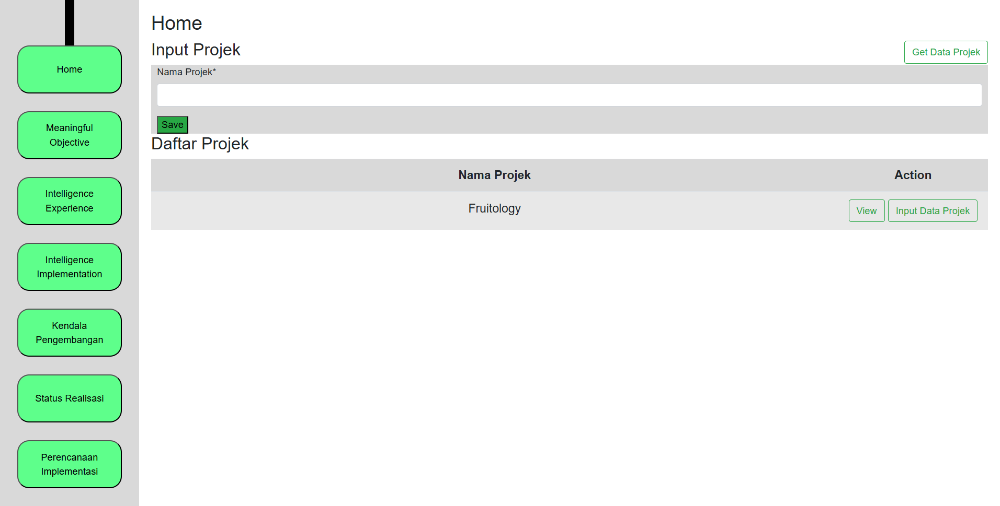

# 📘 Aplikasi Intelligence Engineering

# Deskripsi  
**Intelligence Engineering** adalah aplikasi web berbasis Django yang digunakan untuk mengelola proses perancangan rekayasa perangkat lunak. Aplikasi ini membantu pelaksana proyek untuk mencatat tujuan, pengalaman, serta implementasi kecerdasan dalam pengembangan perangkat lunak, agar sesuai dengan standar perancangan yang ditetapkan.

## ✨ Fitur Utama
- Merekam **meaningful objectives** seperti organizational objectives, leading indicator, user outcomes, dan model properties
- Merekam **intelligence experience**, seperti metode otomatisasi, prompting, annotating, dan fungsi-fungsi cerdas
- Merekam **intelligence implementation**, termasuk proses bisnis dan teknologi pendukung sistem cerdas
- Merekam **hambatan dan batasan** dalam pengembangan modul perangkat lunak
- Merekam **rencana implementasi** software seperti deployment dan pemeliharaan
- Tampilan responsif menggunakan Bootstrap

## 🛠️ Teknologi
- Python 3
- Django 4
- HTML5 + CSS3 + Bootstrap
- SQLite (bisa disesuaikan ke MySql)

## 🚀 Instalasi

1. Clone repositori ini:
   ```bash
   git clone https://github.com/AdamHidayat31/Project_Intelligence_Engineering_Web.git
   cd Project_Intelligence_Engineering_Web
2. Aktifkan virtual environment dan install dependencies:
   ```bash
   python -m venv venv
   source venv/bin/activate  # atau venv\Scripts\activate di Windows
   pip install -r requirements.txt
3. Migrasi database:
   Jalankan perintah berikut di dalam folder 'Proj_IntEng/intel_engineer/'
   ```bash
   python manage.py makemigrations
   python manage.py migrate
4. Jalankan server:
   ```bash
   python manage.py runserver
5. (Opsional) Buat superuser:
   ```bash
   python manage.py createsuperuser
## 🖼️ Tampilan Aplikasi

## 📁 Struktur Proyek
  ```
  Proj_IntEng/
  └── intel_engineer/
      ├── data_intel/         # App utama Django
      ├── intel_engineer/     # Folder konfigurasi proyek Django
      ├── static/             # File statis (CSS, JS, gambar)
      ├── templates/          # HTML templates
      ├── db.sqlite3          # Database SQLite
      └── manage.py           # Entry point Django
  ```
## 👥 Kontributor
- Adam Hidayat - Developer Utama

Sebelum menggunakan menjalankan sebaiknya download terlebih dahulu library berikut:

"python -m pip install django"

"pip install django-crispy-forms"

"pip install crispy-bootstrap4"

"pip install django-cors-headers"

"pip install djangorestframework"

"pip intsall mysqlclient"

"pip install pillow"

"pip install requests"
